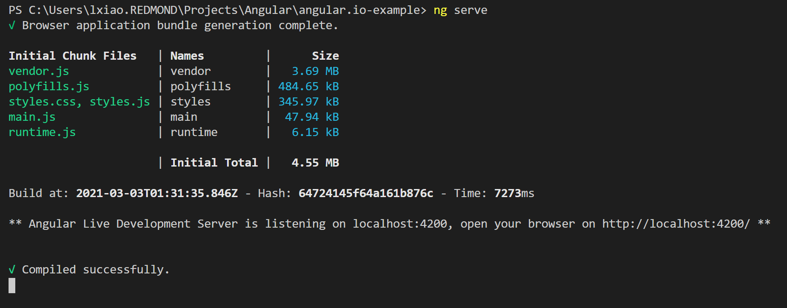
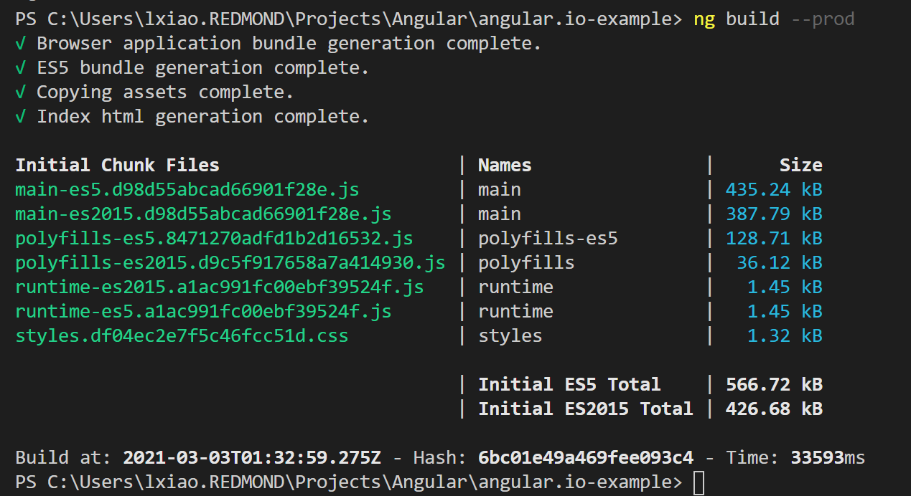
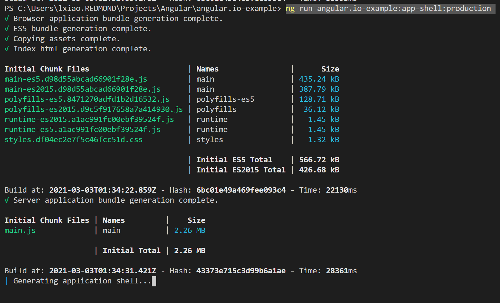

# angular-clean-app-with-AI
1. `npm install`

2. Replace your ikey in `app.component.ts` file.

3. `ng serve` - **Dev build works fine**

4. `ng build --prod` - **Regular Prod build works fine**

5. `ng run angular.io-example:app-shell:production` - **App Shell Prod build NOT WORKNING, TIMEOUT**

solution : to use [Snippt setup](https://github.com/microsoft/ApplicationInsights-JS#snippet-setup-ignore-if-using-npm-setup) instead of [NPM setup](https://github.com/microsoft/ApplicationInsights-JS#npm-setup-ignore-if-using-snippet-setup) AppInsights. Remember to configure [enableAutoRouteTracking: true](https://github.com/microsoft/ApplicationInsights-JS#single-page-applications).
